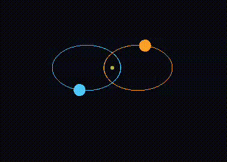
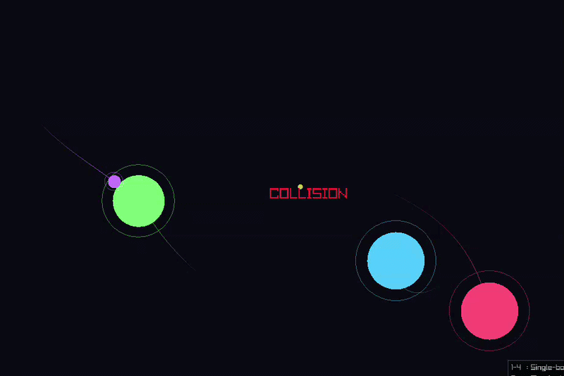

# Orbital Mechanics Simulator

A real-time 2D orbital mechanics simulator written in C, featuring Newtonian gravity, RK4 numerical integration, and interactive orbit presets — including gravitational two-body and N-body simulations.





---

## Features

- **6 simulation modes** selectable at runtime
  - Circular LEO (400 km altitude)
  - Elliptical orbit (high eccentricity)
  - Geostationary orbit (35 786 km)
  - Escape trajectory (hyperbolic)
  - **Two-body gravitational simulation** (equal masses, mutual orbit)
  - **N-body gravitational simulation** (5 bodies, randomised masses and positions)
- **Adjustable time scale** from 10× to 50 000× real time
- **Orbital trails** rendered via circular buffers (2 000 points per body), color-matched per planet in N-body mode
- **Live HUD** showing preset name, simulation speed, and elapsed time
- Collision detection (Earth surface / object-to-object)
- All physics in SI units; display scales independently

---

## Build

```bash
# Requires raylib installed system-wide
make

# Custom raylib path
make RAYLIB_DIR=/path/to/raylib

# Clean
make clean
```

**Compiler:** GCC, C11, `-O2 -Wall -Wextra`
**Dependencies:** raylib, libm, libGL, libX11 (Linux) / OpenGL + Cocoa (macOS)

---

## Controls

| Key | Action |
|-----|--------|
| `1` | Circular LEO |
| `2` | Elliptical orbit |
| `3` | Geostationary orbit |
| `4` | Escape trajectory |
| `5` | Two-body simulation |
| `6` | N-body simulation |
| `Space` | Pause / Resume |
| `R` | Reset current preset |
| `+` / `-` | Increase / Decrease time scale |
| `Esc` | Quit |

---

## Physics & Mathematics

All physics runs in SI units. The display layer applies a separate pixel scale (25 km/px for single-body, 1 000 km/px for two-body and N-body).

### Newton's Law of Universal Gravitation

The gravitational force between two bodies is:

```
F = G · M · m / r²
```

where `G = 6.674 × 10⁻¹¹ m³ kg⁻¹ s⁻²` is the gravitational constant, `M` is the central mass, `m` is the satellite mass, and `r` is their separation.

Per unit mass, the acceleration vector is:

```
a = -GM / r³ · r̂   →   aₓ = -GM·x / r³,   aᵧ = -GM·y / r³
```

The sign is negative because gravity points toward the attracting body (the origin).

### State Vector

Each object is represented by a 4-element state vector:

```
y = [x,  y,  vx,  vy]
```

Its time derivative is the ODE right-hand side:

```
ẏ = [vx,  vy,  -GM·x/r³,  -GM·y/r³]
```

This turns Newton's second law (a second-order ODE) into a first-order system that the integrator can step forward in time.

### Runge-Kutta 4 (RK4) Integration

Rather than a simple Euler step (`y += ẏ·dt`, which accumulates error rapidly), the simulator uses the classical fourth-order Runge-Kutta method. For each timestep `dt`:

```
k1 = f(t,           y)
k2 = f(t + dt/2,    y + dt/2 · k1)
k3 = f(t + dt/2,    y + dt/2 · k2)
k4 = f(t + dt,      y + dt   · k3)

y_{n+1} = yₙ + (dt/6) · (k1 + 2·k2 + 2·k3 + k4)
```

Each `kᵢ` is a slope estimate at a different point within the interval. The weighted average gives fourth-order accuracy — the local error is O(dt⁵) and the global error is O(dt⁴). At `dt = 1 s`, orbits remain stable for thousands of simulated hours without significant drift.

### Orbit Classification

The simulator computes three conserved orbital quantities to classify the orbit:

**Specific mechanical energy** (kinetic + potential per unit mass):

```
ε = v²/2 - GM/r
```

- `ε < 0` → bound orbit (ellipse or circle)
- `ε ≥ 0` → unbound orbit (escape / hyperbolic)

**Specific angular momentum** (z-component of r × v):

```
h = x·vᵧ − y·vₓ
```

**Orbital eccentricity** (derived from ε and h via the vis-viva relation):

```
e = √(1 + 2ε·h² / (GM)²)
```

| Eccentricity | Orbit type |
|---|---|
| `e ≈ 0` | Circular |
| `0 < e < 1` | Elliptical |
| `e = 1` | Parabolic (marginal escape) |
| `e > 1` | Hyperbolic (escape) |

### Orbit Presets — Initial Conditions

Each preset places the satellite on the +x axis with velocity in the +y direction.

**Circular velocity** at radius `r` from Earth's centre:

```
v_c = √(GM / r)
```

Derived by equating centripetal acceleration to gravitational acceleration: `v²/r = GM/r²`.

**Escape velocity:**

```
v_e = √(2·GM / r)
```

Set `ε = 0` and solve for `v`.

| Preset | Altitude | Initial speed |
|--------|----------|---------------|
| Circular LEO | 400 km | `v_c` at LEO radius |
| Elliptical | 400 km perigee | `1.6 · v_c` (high eccentricity) |
| GEO | 35 786 km | `v_c` at GEO radius |
| Escape | 400 km | `1.05 · v_e` (5 % above escape) |

### Two-Body Gravitational Simulation

In the two-body problem, neither body is fixed — both accelerate toward each other according to Newton's third law. The equations of motion become coupled:

```
ẍ₁ =  G·M₂ · (x₂ − x₁) / |r₁₂|³
ẍ₂ =  G·M₁ · (x₁ − x₂) / |r₁₂|³
```

where `|r₁₂| = √((x₂−x₁)² + (y₂−y₁)²)` is the separation.

**Conservation laws verified by the simulation:**

- Total linear momentum: `p = M₁·v₁ + M₂·v₂ = 0` (zero-momentum frame)
- The centre of mass remains stationary at the origin; the camera tracks it

**Initial circular orbit speed** for two equal masses `M` each at distance `d` from their common centre:

```
F_gravity    = G·M² / (2d)²        (separation = 2d)
F_centripetal = M·v² / d

→  v = √(G·M / (4·d))
```

The RK4 integrator is extended to handle the coupled 8-dimensional state simultaneously, ensuring that the slope estimates `k1`–`k4` for both objects are always computed at the same intermediate time and position — preserving the symmetry of the force law.

### N-Body Gravitational Simulation

The N-body mode simulates 5 bodies with randomised masses and initial conditions, all mutually attracting. The total acceleration on body `i` is the vector sum of forces from every other body `j`:

```
aᵢ = Σⱼ≠ᵢ  G·Mⱼ · (rⱼ − rᵢ) / |rⱼ − rᵢ|³
```

**Softened gravity** is used to prevent the acceleration from diverging as two bodies approach each other:

```
aᵢ = Σⱼ≠ᵢ  G·Mⱼ · (rⱼ − rᵢ) / (|rⱼ − rᵢ|² + ε²)^(3/2)
```

where `ε = 1×10⁷ m` is the softening length. Without it, a near-miss would produce a numerically unbounded force spike that corrupts the integration.

**Collision detection** triggers when the centre-to-centre distance falls below the sum of the two physical radii:

```
|rⱼ − rᵢ| < rᵢ + rⱼ
```

When a collision is detected the simulation halts and displays a "COLLISION" message.

**Initial conditions** are generated randomly each time mode 6 is selected or reset:

- Masses drawn from a fixed pool ranging from `1×10²⁶` to `9×10²⁶ kg`
- Positions placed randomly within a bounded region, with a 2× radius exclusion zone to prevent spawning inside each other
- A small random tangential velocity is assigned to each body
- The entire system is shifted so that the centre of mass starts at the origin and the net momentum is zeroed, placing the simulation in the zero-momentum frame

**The RK4 integrator** is extended to the full N-body state: all N planets are integrated simultaneously, with the slope estimates `k1`–`k4` computed from the full mutual-force calculation at each sub-step. Mass and radius are non-dynamic quantities carried through the integration unchanged.

**Trails** — each planet owns a 2 000-point circular trail buffer. One screen-space position is pushed per frame (60 Hz), giving ~33 seconds of visible history. Trails are rendered as fading line segments in each planet's assigned color, with alpha proportional to age.

---

## Architecture

```
config.h          — all physical constants, simulation parameters, Trail and Planet structs
src/physics.c     — gravity ODE RHS (single-body, two-body, N-body with softening)
src/solver.c      — RK4 integrator (single-body, two-body, N-body variants)
src/trail.c       — circular buffer for orbital trail rendering
src/main.c        — raylib render loop, input handling, HUD
```

---

## Display Scaling

```
Single-body:  1 pixel = 25 000 m  (25 km/px)
              Earth radius ≈ 254 px on screen
              Screen centre = Earth centre

Two-body:     1 pixel = 1 000 000 m  (1 000 km/px)
              Camera origin = centre of mass

N-body:       1 pixel = 1 000 000 m  (1 000 km/px)
              Camera origin = centre of mass (recomputed each frame)
```

All coordinate transforms are in `main.c` via `world_to_screen()` (single-body) and `world_to_screen_tb()` (two-body and N-body, CoM-relative).
